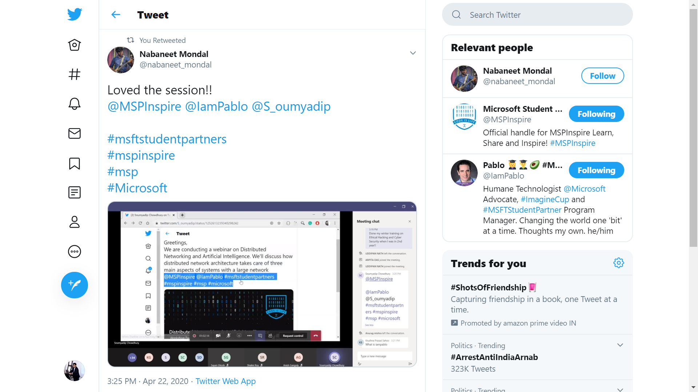
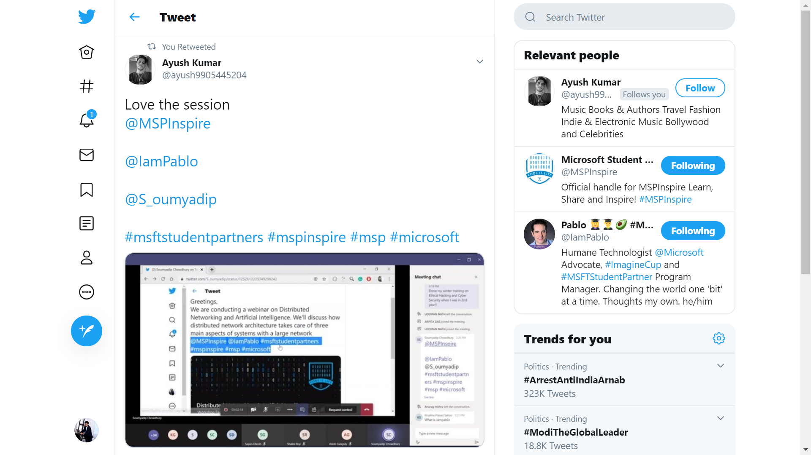
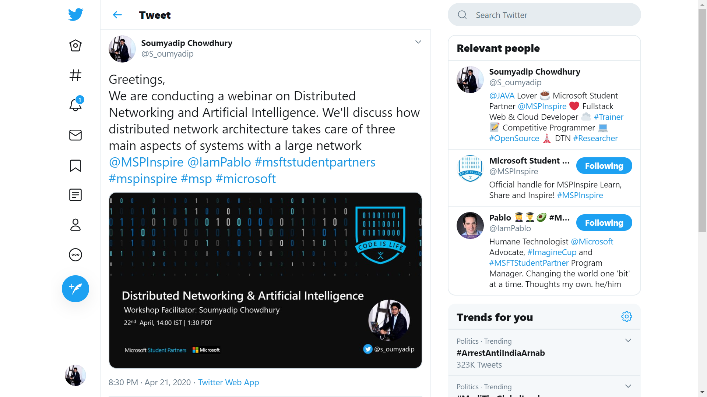
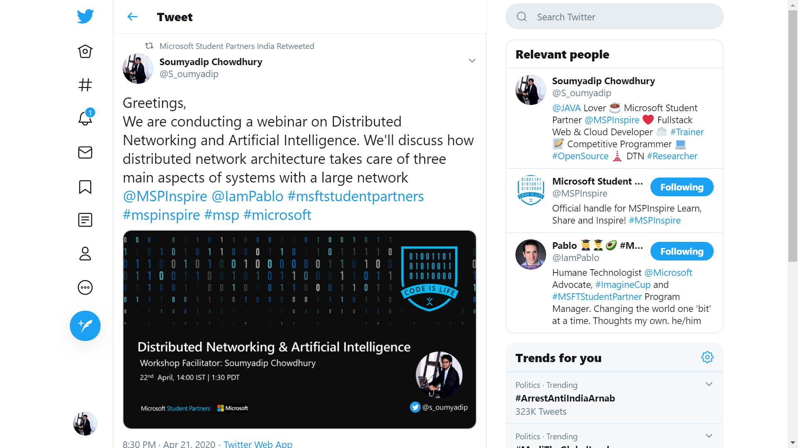
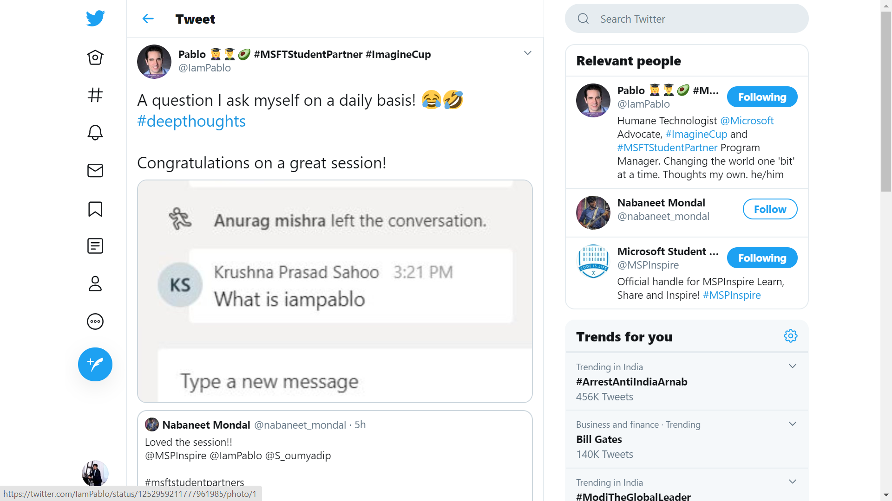
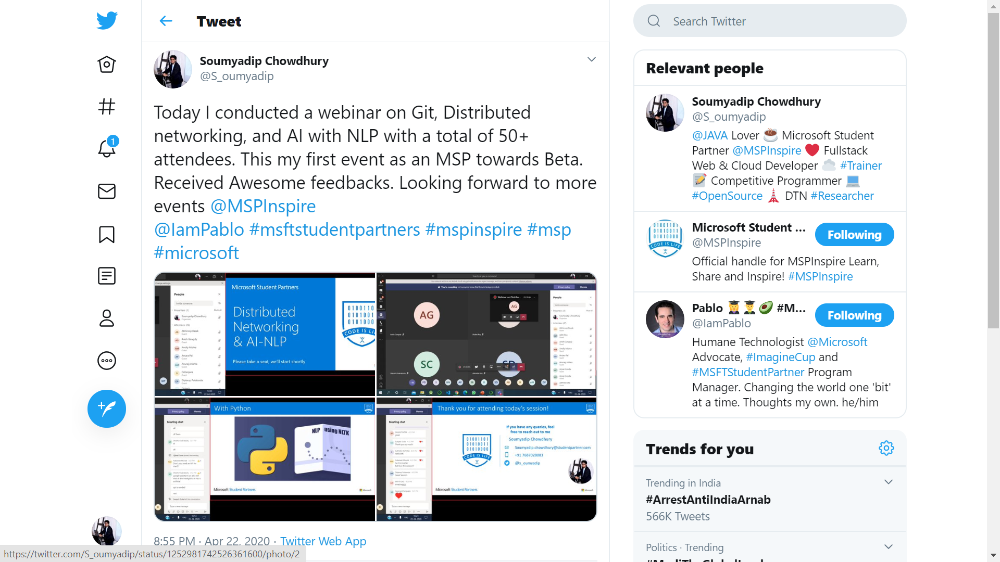
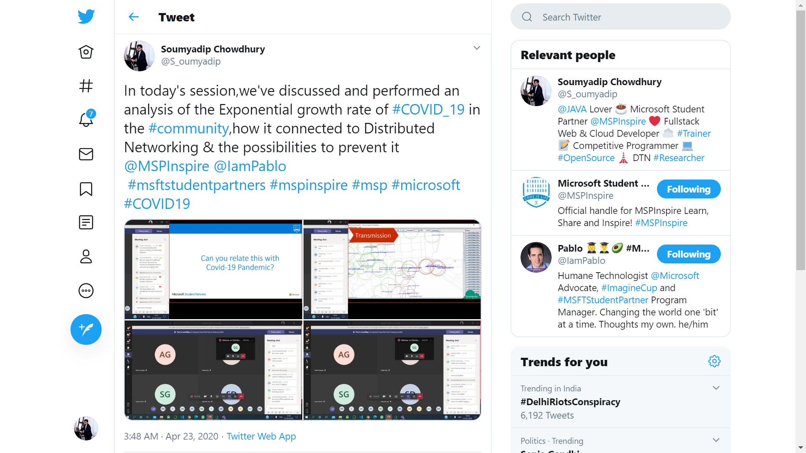

# Microsoft-Student-Partner-Workshop-Learning-Materials
This repository contains all codes and materials of the current session. It contains the  required code on Natural Language Processing, Artificial intelligence.

# Event #01

# Event #01 Tweets

